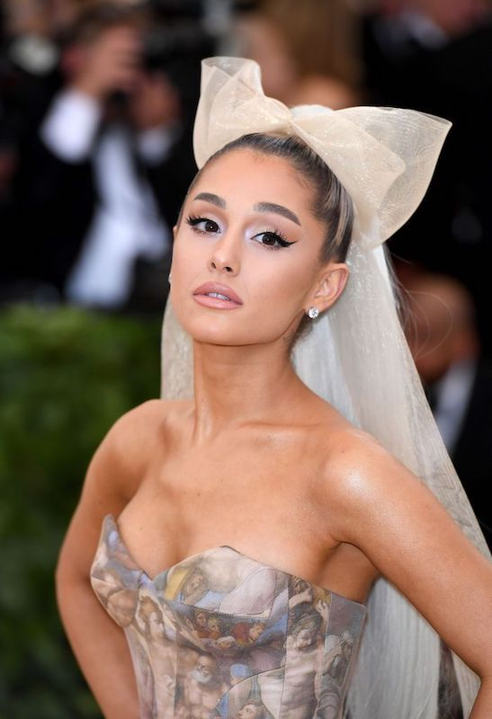
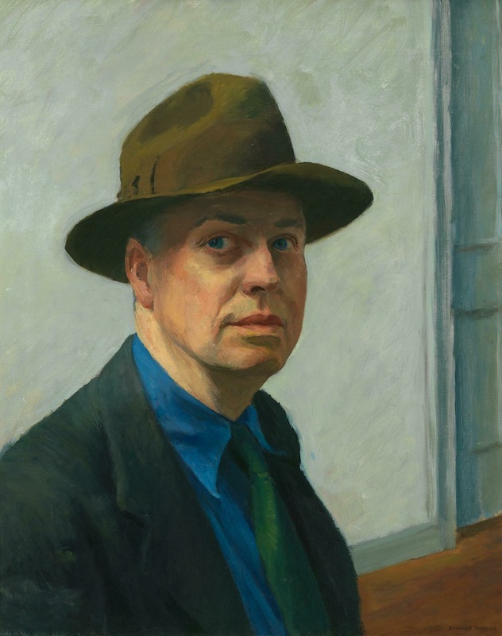
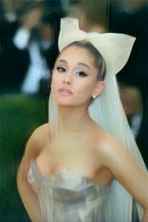

# Style-Transfer-PyTorch

## Project Highlights
Simple fun project with images using transfer learning of a trained VGG19 model to learn the thematic style of an image in order to manipulate another image to match the style.

## Model Description
In order to implement to style transfer model with VGG19, 2 images preferably of the same size are required. Freeze all the weights in convolution layers VGG19 and remove the dense layers. The 2 image together with an "random generated" image which will become the generated output of the model are passed into the model separately and the generated image will be adjusted to minimize the content and style losses.

## Examples

	
	

	
