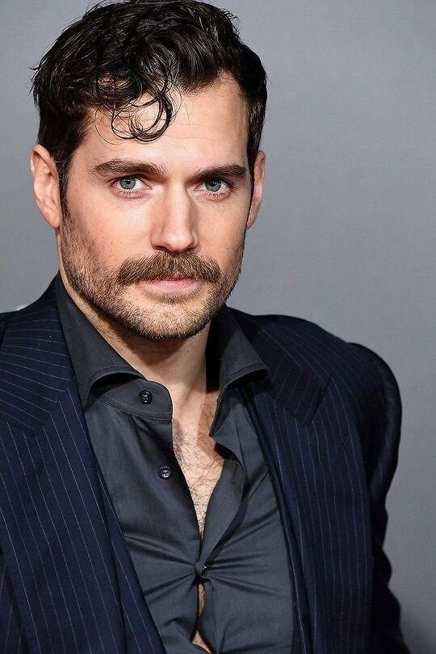
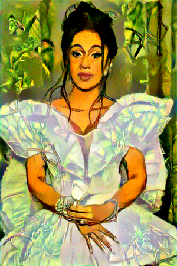

# Style-Transfer-PyTorch

## Project Highlights
Simple fun project with images using transfer learning of a trained VGG19 model to learn the thematic style of an image in order to manipulate another image to match the style.

## Model Description
In order to implement style transfer model with VGG19, 2 images preferably of the same size are required. Freeze all the weights in convolution layers VGG19 and remove the dense layers. The 2 images, together with a learned image which will become the generated output of the model, are passed into the model separately. During the learning process, the pixels of generated image are tweaked to minimize the content and style losses, just like the node parameters in a neural network.

## Examples

	
	

	

	
	

	

	
	

	

	
	

	

## Supplement Image Project: Reproducing Image Using ASCII Character
The pixel intensity values are binned so that each bin is represented by an ascii character. The ascii character are chosen based on the number of "strokes", and are arranged based on the "darkness" of the character. 
